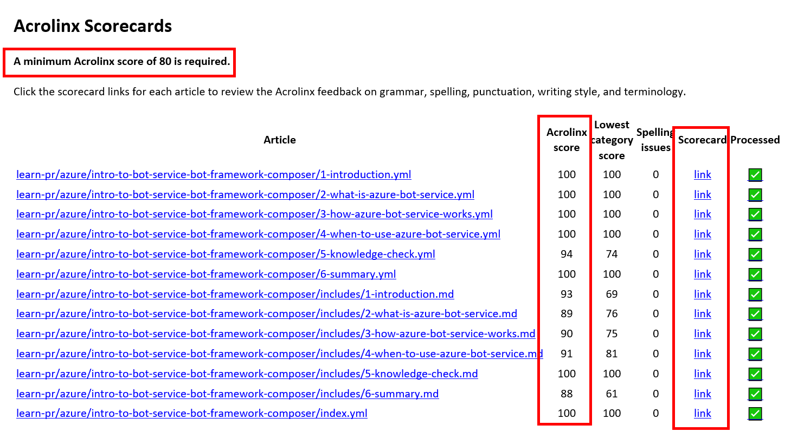
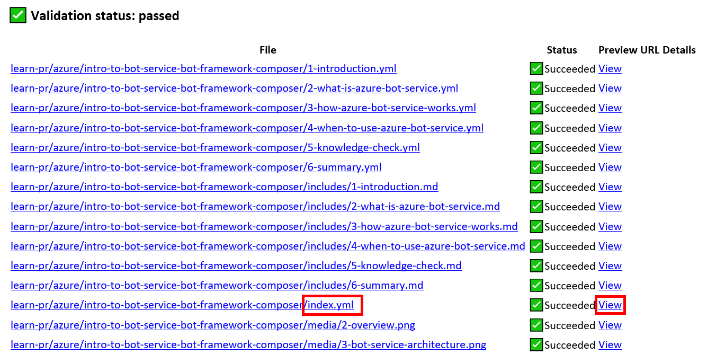
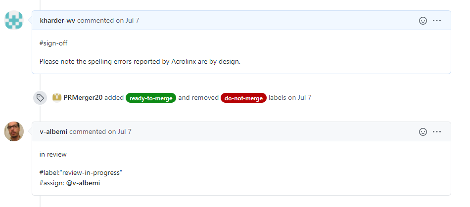
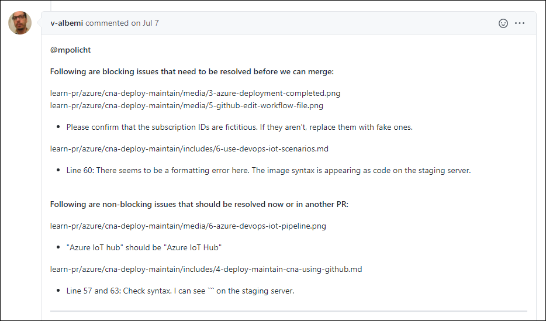

The exact scope and details of every microlearning development project is unique in terms of the exact scope and details. However, there are certain similarities between most projects. Here are some details about “typical” projects.

## Project duration

Project duration can vary drastically based on module type, volume, and customer needs. A ballpark estimate for a “typical” project is between eight and 16 weeks. Your involvement will vary depending on the project’s type and size and your specific role. *Contact your Project Manager (PjM) for more information.* 

Projects start when contracts are signed between Waypoint and its customer. We consider them finished after our detailed reviews and testing processes confirm that content is fully qualified for publishing. A project’s development phase, where content is designed and created, typically starts around the fourth week of a project schedule and lasts between four and six weeks.

## Project phases

Most projects have six phases:

1. Engagement
2. Initiation
3. Design
4. Development
5. Publication
6. Project closeout

These materials cover phases 3, 4, and 5.

# Overview of the microlearning module-creation process

This guide focuses on three phases in creating microlearning modules. It covers phase 3 (Design) through phase 5 (Publication).

Note: This image provides a high-level overview of the module-creation process. For detailed information and activities, please refer to your project schedule and ask your PjM more information. 

## Design

### Create module design

Creating a module’s design document, or *design doc* as we refer to it, is the first step in module development. A design doc should contain a high-level overview of all topics, exercises, and videos that the module will include. Additionally, a design doc should include specifics about the level (difficulty) of the material and expected audience; and then module scenarios, titles, learning objectives, prerequisites, structure of individual units, and descriptions of exercises. 

A design doc provides SMEs and Microlearning Specialists an opportunity to examine the flow of material, the timing of each component, and whether the content adequately addresses the prescribed learning objectives. 

Creating the Module design document is the first step in module development. A design document should contain:

- A high-level overview of all topics, exercises, and videos in a module. 

- The level (difficulty) of material, audience, and prerequisites

- A module scenario, title, and the module learning objectives

- The unit structure

- Descriptions of the units and exercises. 

A design document gives a project’s Subject Matter Experts and Microlearning Specialists an opportunity to examine the flow of material and each component’s timing, to help determine whether the content adequately addresses the specified learning objectives. 

>**Note:** An MLS often will assist a SME with creating a module’s design so that it fulfills our statement of work and meets requisite delivery standards.

SMEs must use the provided Microsoft Word template to create a module’s design document, as it contains the required layout and content that Microsoft expects for microlearning modules. 

>**Note:** It’s imperative that you use headings and other Word paragraph styles that the template provides, as these are required for converting Word content to markdown. 

An approved, detailed Microsoft Word template will be provided to SMEs for use in creating a module’s design document. It contains the correct layout and content that Microsoft expects for a Microlearning module. 

Note: It’s imperative to use the headings and other Word paragraph styles in the template, as they’re required for successfully converting Word files to markdown. 

The template also contains comments that’ll help guide SMEs as they develop microlearning content, particularly with respect to adding the correct content in the proper format. It also contains links to pertinent articles about development and other topics in the [Microsoft Learn Contributor Guide](https://review.docs.microsoft.com/en-us/help/learn/?branch=main).

>**Important!** A module’s design *must adhere* to the guidance from the [Microsoft Learn Contributor Guide](https://review.docs.microsoft.com/en-us/help/learn/?branch=main). All SMEs and Microlearning Specialists must be familiar with the portions of the guide that apply to all content they create and edit. We recommend that you start by reading the content under [Authoring Guidelines](https://review.docs.microsoft.com/en-us/help/learn/id-guidance?branch=main) section.

### Reviews of module design

There are two main review passes for a module’s design doc: the MLS review and the copy-edit pass.

#### MLS review of a module’s design 

The MLS performs an instructional-design review on the module’s design to ensure that it aligns with Microsoft Learn Contributor guide guidelines. They also ensure that the content flows well, that the units and modules all have timings that are appropriate, and that the material reflects the learning objectives specified. Additionally, after the MLS review:

- The SME reviews the tracked changes from the MLS review and leaves their own comments and tracked changes. The MLS resolves all comments and tracking.

- The customer reviews, and provides sign off for, the module design.

##### Design Charette Meeting

To capture customer feedback, we use a Design Charette Meeting format for each module in the project, as follows:

1. The SME, PjM, MLS, and customer participants are all present at the meeting. 

2. A day before the meeting, the PjM sends participants (who the customer identifies) a link to the applicable module design document. The document is written in Word, and is sent to the customer with Track Changes turned on. The PjM also sends “starter questions” to get participants ready for the meeting.

3. At the meeting, the SME thoroughly reviews the design with the team to clarify all pieces of it. The SME also fields questions and provides responses, and notates any conflicting information for further review. The MLS takes notes while also listening for any comments or requests that might conflict with the Learn Contributor Guide. The PjM is listening for any requests or comments that are out of scope for the project’s SOW.

4. Typically, the SME incorporates requested changes, researches and resolves conflicting information, and then the MLS reviews and resolves those updates.

#### Copy-edit pass of a module’s design

All of our design docs go through a full copy-edit pass prior to final sign off. The Copy Editor (CE) reviews the module designs for grammar, clarity, flow, and to determine if it meets style mandates set forth by Microsoft and MS Learn. The CE uses Word’s Track Changes functionality to indicate all recommend edits and inserts comments where applicable. The CE also runs the FindWords macro and Word’s Editor tool before submitted the edited design doc to the MLS for review and resolution. The MLS might ask for input from the SME for clarifications about comments, edits, or user-interface (UI) elements the copy editor asks about. The MLS resolves any remaining comments and changes.

## Development

### SME creates module content

In this phase, the SME writes the module content, requests conceptual graphics from our Media Production team (MPs), and develops exercise steps and/or creates a video concept document. 

>**Note:** A *video concept document* is a 300-words-or-less “directorial guidance” document provided to Microsoft to obtain a desktop demonstration video with captions. 

Here are some important items to note:

- The SME must use the provided Module template in Word to create the module. The Module template contains the required structure and format for the module, and includes helpful notes and links to pertinent portions of the [Microsoft Learn Contributor Guide.](https://review.docs.microsoft.com/en-us/help/learn/?branch=main) Like a module’s design document, the actual module units *must conform* to the Microsoft Learn guidelines. SMEs must use the provided templates and not their own formats.

>**Note:** It’s imperative to use the headings and other Word paragraph styles that provided templates use. These are necessary to confirm to Learn requirements and standards, and also enable us to correctly and seamlessly convert Word files to markdown. 

- A project’s customer signs off on the completed design document. Therefore, the SME must adhere to that document. Otherwise, a Change Order is required. A PjM must administer all change orders.

- During development, you’ll need to identify the need for any conceptual graphics or demonstration videos, and work with the assigned Multimedia Provider (MP) to create these deliverables.

>**Note:** We recommend that you limit your use of screenshots, because they can quickly become out of date.

- For the student “hands on” exercises, the SME determines the exercise steps and chooses one of two environments:

	1. A Microsoft Azure sandbox.

	2. A Bring-Your-Own-Subscription (BYOS), where students use their own Azure account.

#### Writing style

Here are some recommendations to make your content flow and align with Microsoft and Learn style standards:

- Write with active voice using [Microsoft writing principles](https://review.docs.microsoft.com/en-us/help/contribute/writing-principles?branch=main) and [Style Guide](https://styleguides.azurewebsites.net/StyleGuide/Read?id=2700).

- For exercises or descriptions of steps, use [Microsoft style for procedures](https://styleguides.azurewebsites.net/Styleguide/Read?id=2700&topicid=29016). Be vigilant about using the correct full naming convention (on first reference), spelling, and capitalization of all tools, products, components, terms, and UI elements. 

Tip: The SME can take screen captures of the UI as they work in the app or tool. These might help the MLS and CE when they’re conducting their passes, and reviewing procedures and exercise steps.

### Module reviews

Note: If a module has exercises, the exercise units are sent for Functional Testing. This happens any time after completion of the exercise units and the SME effects all fixes and remediation.

#### ID pass

During this step, the MLS reviews the module using instructional-design principles to guide their evaluation. They’re reviewing for clarity of writing, terminology, correct use of Microsoft style, correct and concise exercise steps, and other items. The SME needs to be available during the ID pass for questions and clarifications, such as with respect to terminology spelling and capitalization or procedural steps.

#### Copy Edit pass

After the MLS pass is complete, the MLS hands off the module to CE, who performs a line edit of the content, reviewing for grammar, clarity, flow, and writing style and sentence structure, and also determines whether terminology and capitalization are correct for all products, terms, components, tool, and similar. The CE also helps tighten sentence structure, as complex sentences can result in low Acrolinx scores (successful publication is contingent on sufficient Acrolinx scores). CE also runs the FindWords macro and Editor tool on all content to ensure it’s compliant and correct, and uses track changes and comments to conduct their edits. Once the CE finishes their pass, they submit their edited content to the MLS. The MLS resolves or rejects the tracking, and may ask the SME questions to clarify the content.

#### Create a branch off the master

In GitHub, the MLS creates an MLS branch off the master to use for the module. One branch is made per module. The MLS can create this branch through a browser in GitHub or [in Visual Studio Code (VSC](https://waypointventures.github.io/docs/branches/new-branch.html)). 

The MLS then [invites people with the following roles as collaborator](https://waypointventures-my.sharepoint.com/personal/karinca_waypoint_ws/Documents/Invite collaborator)s:

- SME

- PjM

- CE

For detailed information about using VSC and GitHub, please refer to [Waypoint Ventures documentation](https://waypointventures.github.io/docs/add-content/syntax.html). Keep in mind that these instructions may suggest procedures that don’t align with microlearning. Contact your PjM if you have questions.

### Convert content to markdown and move to GitHub

Prior to Compliance testing, the MLS moves the module files to GitHub.

Most of the development process happens in Word, so authors and reviewers can take advantage of Word’s excellent commenting and tracking features. Just before pre-publishing tests, the MLS uses Typora to convert the module Word files to markdown. 

The MLS opens the markdown files in VSC and performs a global review and conducts remediation, including fixing bulleted lists and checking for correct syntax including headings, tables, images, and links. The MLS then uploads the markdown files to GitHub. 

### Compliance testing

The MLS performs the Compliance testing pass, where they assess the content for issues in the areas of accessibility, global readiness, licensing, and privacy. The MLS corrects any issues found.

>**Note:** When in doubt, please escalate questions to the Compliance team via your PjM. 

### MLS creates a pull request from the MLS branch

After the files are uploaded to GitHub, the MLS creates a [pull request](https://waypointventures.github.io/docs/workflow/terminology.html#using-prs) to merge their branch back into the master branch. 

> **Important!** The MLS *should never merge* their branch into the master branch. The PjM performs this action just prior to publication. 

Read more about [pull requests](https://docs.github.com/en/github/collaborating-with-pull-requests/proposing-changes-to-your-work-with-pull-requests/about-pull-requests).

### Quality tests

The MLS performs all content testing in this phase to ensure the module is ready for publication. 

>**Note:** To perform quality tests, the MLS must link their v-dash to their GitHub account so as to have the requisite permissions to perform these steps.

After the MLS create the pull request (refer to the previous step), anytime files are changed or added to GitHub, such as when you push changes from VSC, several automatic checks occur and are reported via email to the pull request’s owner. The automatic checks include generation of an Acrolinx scorecard with a score for each file (markdown and yaml) and a Validation (build) status, which sent to the MLS as emails.

#### Acrolinx Scorecards

Acrolinx Scorecards provide detailed information about how your markdown and yaml content meets defined standards and requirements, providing metrics whereby you can improve your Acrolinx scores prior to publication. At a minimum, all Learn content must have a minimum Acrolinx score of 80. However, at Waypoint, we encourage you to strive for a score of 100 for all files.

The Acrolinx program scans all markdown and yaml files and then provides a detailed report about issues it finds, including spelling errors, sentences that are too long or complex (it likes them short and snappy—no compound sentences), word choices (it prefers simple words), and passive construction.

>**Note:** Please review all Acrolinx results, even if a file has a score above 80, to determine whether it’s flagged any spelling errors. If spelling errors are by design, such as a product name or code snippet, the PjM should make a note to that effect in the “#sign-off” comment during the publication phase. 

>**Hint:** To see details about the score for a particular file, select **link** in the **Scorecard** column.

#### Validation (build) status

This automated check determines whether files are working correctly together to create a “finished” module. For example, in each .yml file, there’s a path for the corresponding markdown file. If the markdown file is not named correctly, this test returns an error.

- To view a detailed report for any file, click its hyperlink. 

- To preview the module as it will look in its published form, select the **View** link for the index.yml file. This will open the first page in the course. Selecting the **View** link for another page will open that page.

The MLS checks the automated build reports and ensures that all content can publish without errors.

The MLS checks the Acrolinx scorecard and Validation (build) status emails for problems and fixes them in the appropriate .md or .yml files.

## Publishing

Once all units of a module have an Acrolinx score of 80 or higher and pass all build-validation tests, the MLS hands off the module to the PjM, who then submits it to Microsoft for their publishing process:

1. The PjM adds “#sign-off” to the comments in the pull request.
2. The pull request gets assigned to the appropriate Microsoft reviewer.

3. The Microsoft Reviewer responds with feedback in comments.

4. The PjM resolves the issues raised in the Microsoft reviewer’s comments.
5. The PjM comments and adds “#sign-off” in comments in the pull request.
