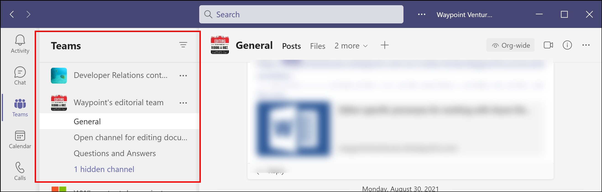

# Welcome to Waypoint!

Welcome to Waypoint Ventures! We’re glad you’ve joined our team.

We’ve found that people who fill Subject-Matter Expert (SME) Writer and Microlearning Specialist (MLS) roles typically have a smoother experience developing content if they understand their [role on the development team]({{site.baseurl}}/01-people/01-who-is-who.html), including what we expect of them (and what we don’t), and who else might be on their team. We think you’ll find these materials helpful as you dig into Waypoint’s development process and your critical role in it.

>**Note:** This high-level onboarding material is oriented toward general content development. However, some of it specifically targets development of microlearning content.

## Get started

On this page, read about communication, credentials, and information management. You might also want to:

- Get an overview of a [typical microlearning project]({{site.baseurl}}/projects/typical-ml-project-information.html).
- Learn what [content development tools]({{site.baseurl}}/projects/content-development-tools.html) you'll need.
- Read ["Who's who on the team"]({{site.baseurl}}/people/who-is-who.html) to learn about your roles and responsibilities, and those of your teammates.

## Recommended communication methods

Waypoint has guidelines to help you decide how best to communicate about project matters and milestones.

We recommend that you use:

- Email (the newest version of [Outlook](https://support.microsoft.com/en-us/office/outlook-training-8a5b816d-9052-4190-a5eb-494512343cca)) for communications of record, such as assignments, [hand-offs](https://waypointventures.sharepoint.com/:p:/r/sites/Home/_layouts/15/Doc.aspx?sourcedoc=%7B780B3B73-6779-4D8E-A506-0BA3B1372DE5%7D&file=Waypoint%20Hand-off%20Foundations.pptx&action=edit&mobileredirect=true), sign-offs, and similar communication. Email is the most reliable communication method for threads and information that we want to retain within a project record.
- A [Microsoft Teams](https://support.microsoft.com/en-us/office/microsoft-teams-video-training-4f108e54-240b-4351-8084-b1089f0d21d7?ui=en-us&rs=en-us&ad=us) chat for quick conversations with another team member or two. Do you need a question answered or a point clarified? A Teams chat message is essentially an instant message (IM) that’s useful for information conversations.
- [Teams channel](https://support.microsoft.com/en-us/office/work-in-channels-99d33aaa-0743-47c6-a476-eb0a24abcb7e) conversations for projects. You’ll typically use a specific Teams site’s General channel and conduct your conversation there. Channel conversations are great for sharing concepts and ideas, and for team-wide messaging, kind of like a whole-team chat session. Again, if you want to draw the attention of a specific person or persons, tag them.

    >**Tip:** When starting a Teams chat or channel conversation, tag the person you’re trying to reach to alert them that they have a chat waiting. To tag a person, in the chat field, enter the @ symbol and then the first few letters of their name. Select their name when it appears. When you've been tagged, a red number will appear over the **Activity** bell icon in the Teams sidebar.

    

- [Meetings](https://support.microsoft.com/en-us/office/meetings-in-teams-e0b0ae21-53ee-4462-a50d-ca9b9e217b67) for when you want a more formal session in which team members connect in an online gathering to discuss an agenda and reach a documented outcome.

    >**Note:** Create all meetings in Outlook, and use the [Scheduling Assistant](https://support.microsoft.com/office/use-the-scheduling-assistant-and-room-finder-for-meetings-in-outlook-2e00ac07-cef1-47c8-9b99-77372434d3fa) and other Outlook tools to ensure those people who need to be at your meeting are available. Be sure to select the **Teams Meeting** button on the ribbon. It generates a Teams meeting link that appears in the meeting-invite email, so you and other participants can select it and join the meeting in Teams.

    

### Microsoft Corpnet credentials

For many Waypoint projects, you’ll receive Microsoft corporate network (Corpnet) credentials. This is a Microsoft email address and password. We refer to these credentials as a *vdash* because the first two characters in the email address are a *v* and a dash (*-*), such as v-johndoe@microsoft.com. The “v” signifies that you’re a Microsoft vendor.

You’ll use your Corpnet credentials to access restricted Microsoft resources. You can also use your Corpnet credentials and Azure Virtual Desktop (called Remote Desktop on your computer) to access a complete Office 365 environment, including Outlook, Teams, and Microsoft Office. Learn more about [Getting and using your Microsoft Corpnet credentials](https://waypointventures.sharepoint.com/:w:/r/sites/Home/_layouts/15/doc2.aspx?sourcedoc=%7B6CC69912-B551-43CD-B842-2A09295BA592%7D&file=Getting%20and%20using%20your%20Microsoft%20Corpnet%20credentials.docx&action=default&mobileredirect=true&cid=12c0dcbc-be09-40a4-a5ab-0e5a387c0065). 

## Information management

Here are the storage locations Waypoint uses for information:

- [Waypoint’s intranet portal](https://waypointventures.sharepoint.com/sites/Home/SitePages/MS-Learn-microlearning.aspx) houses our orientation and internal content development and project management instructional materials.
- [Teams channels](https://support.microsoft.com/office/work-in-channels-99d33aaa-0743-47c6-a476-eb0a24abcb7e) are for internal, project-related materials and conversations.

  
- GitHub, Azure DevOps, and [SharePoint](https://support.microsoft.com/office/introduction-to-libraries-7d4221d9-8fb9-40d5-8441-2374c84b5e26) are used to share content internally and externally. 
- Microsoft Project Online (or “Project Server”) stores in-flight project files and reports. The files are located at [https://waypointventures.sharepoint.com/sites/pwa/Projects.aspx](https://waypointventures.sharepoint.com/sites/pwa/Projects.aspx).
- OneNote, where you’ll find templates for emails, project schedules, meeting notes, and other important content for your project. Contact your Project Manager (PjM) for more information.
